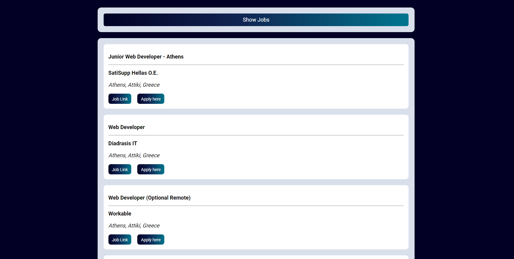

# Job Scraper Demo

## Installation

Run *npm install* to install all dependencies

## How to make it work

### Run mock Database

- Run *npm run mockDb* to start the mock database.
The database is in fact a .json file ( mockData.json ) that works as a database and lets you execute CRUD requests.
For more information check the json-server documentation [here](https://www.npmjs.com/package/json-server)
- To delete the database delete everything and paste the following json object

``{
    "jobs": []
}``

### Fetch job positions by scraping

- Configure the search parameters in config.js
- Run *npm run scrap* to bring the data inside the database.

### Show the data from the database

- Select index.html and open it with Live Server.
- Press the button *Show jobs*.
